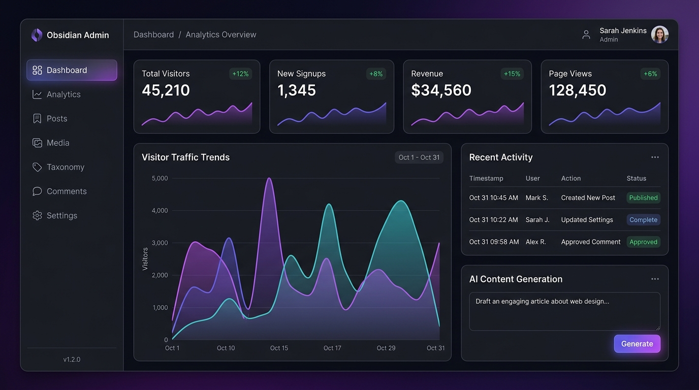
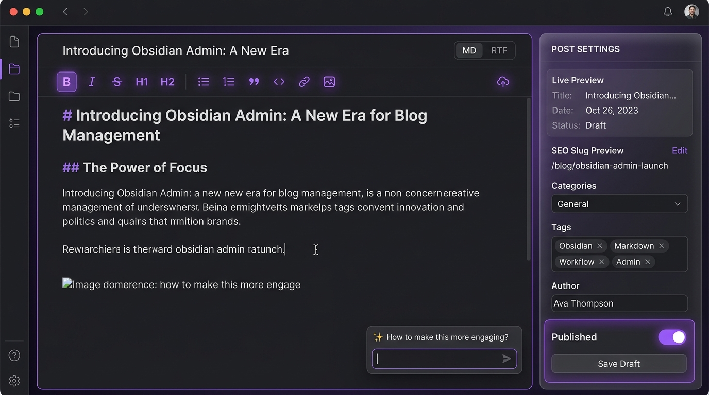

# 🔥 Boilpoint

> Modern, ölçeklenebilir ve yüksek standartlı web projeleri için **Kategorize Boilerplate & Starter Şablon Koleksiyonu**.

<p align="center">
  <a href="https://yunusemrecagan.com/demo/admin/obsidian" target="_blank">
    
  </a>
</p>

Boilpoint; tam teşekküllü yönetim panellerinden (Admin Dashboards), bağımsız header/navbar tasarımlarına, açılış sayfalarından (Landing Pages) mikro UI bileşenlerine kadar her şeyi kategorize edilmiş, modüler ve tak-çalıştır bir yapıda sunar.

---

## 📸 Ekran Görüntüleri (Previews)

<div align="center">
  
  <p><em>💎 Obsidian Admin — Koyu Tema, Analitik & KPI Kokpiti</em></p>
  <br/>
  
  <p><em>✨ Obsidian Editor — Zengin Markdown & AI Destekli İçerik Stüdyosu</em></p>
</div>

---

## 📂 Şablon Hiyerarşisi

```text
boilpoint/
├── README.md                           # Ana katalog ve rehber
├── assets/                             # Önizleme görselleri & ekran görüntüleri
└── templates/
    ├── admin/                          # 🛠️ Yönetim Paneli Şablonları
    │   ├── obsidian/                   # 💎 Koyu tema, cam efektli, AI destekli admin kokpiti
    │   └── minimal/                    # (Yakında) Sade & kurumsal admin paneli
    ├── headers/                        # 🧭 Navbar & Header Koleksiyonu (Yakında)
    │   ├── floating-glass/             # Yüzen cam efektli modern navbar
    │   └── megamenu-saas/              # SaaS mega menülü navbar
    ├── footers/                        # 🔻 Footer Tasarımları (Yakında)
    └── landing/                        # 🚀 Karşılama & Landing Sayfaları (Yakında)
        └── saas-bento/                 # Bento-grid ve Stripe uyumlu SaaS açılış sayfası
```

---

## 📦 Şablon Kataloğu (Catalog)

### 🛠️ Admin Panelleri (`templates/admin/`)

| Şablon | Açıklama | Teknolojiler | Hızlı İndir (`degit`) |
| :--- | :--- | :--- | :--- |
| [**`obsidian`**](./templates/admin/obsidian) · [🔗 Canlı Demo](https://yunusemrecagan.com/demo/admin/obsidian) | Koyu temalı, cam efektli, AI destekli (Gemini + FLUX), analitik & ısı haritalı, tam moderasyonlu kokpit | Next.js 15, Tailwind, Prisma, NextAuth | `npx degit yunusemre-cagan/boilpoint/templates/admin/obsidian my-admin` |
| `minimal` | Sade, minimalist ve hafif kurumsal yönetim paneli | Next.js 15, Tailwind, SQLite/Postgres | *Yakında* |

### 🧭 Header & Navigasyon (`templates/headers/`) *(Çok Yakında)*
* Bağımsız, kopyalanabilir ve modern Tailwind header tasarımları.

### 🚀 Landing Sayfaları (`templates/landing/`) *(Çok Yakında)*
* Modern SaaS, portfolyo ve ürün tanıtım sayfaları.

---

## ⚡ Nasıl Kullanılır?

İstediğiniz şablonu veya bileşeni tüm depoyu klonlamadan, **doğrudan o klasörün yolunu vererek** sıfır bir proje/klasör olarak çekebilirsiniz:

```bash
# 1. İstediğiniz kategorideki şablonu indirin:
npx degit yunusemre-cagan/boilpoint/templates/admin/obsidian yeni-yonetim-paneli

# 2. Projeye girin:
cd yeni-yonetim-paneli

# 3. Bağımlılıkları yükleyin:
npm install

# 4. Çevre değişkenlerini kopyalayın:
cp .env.example .env

# 5. Geliştirme sunucusunu başlatın:
npm run dev
```

---

## 📄 Lisans
Bu depodaki tüm şablonlar [MIT Lisansı](LICENSE) ile lisanslanmıştır. Kişisel veya ticari tüm projelerinizde dilediğiniz gibi kullanabilirsiniz.
