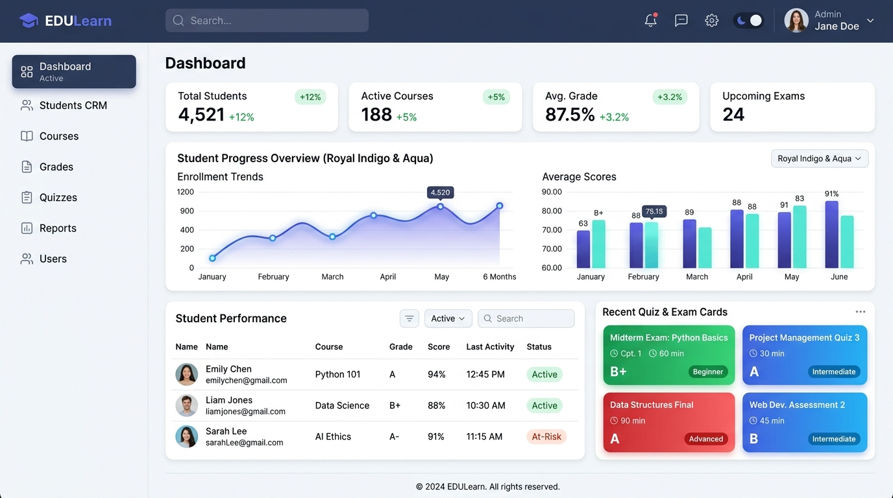

<div align="center">

# 🎓 Academy LMS Dashboard

**Next.js 15+ App Router, Tailwind CSS, Prisma ve Recharts ile Güçlendirilmiş Eğitim & Sınav Yönetim Kokpiti**

*Boilpoint Şablon Koleksiyonu nun öğretmenler, kurslar, akademiler ve online eğitim platformları için tasarlanmış modern yönetim şablonu.*

<br />

[](https://yunusemrecagan.com/demo/admin/academy)
[](https://nextjs.org/)
[](https://www.prisma.io/)
[](https://tailwindcss.com/)
[](LICENSE)

<br />
<br />

<a href="https://yunusemrecagan.com/demo/admin/academy" target="_blank">
  
</a>

<p align="center"><em>🎓 Academy LMS — Royal Indigo Renk Paleti, Öğrenci CRM & Deneme Sınavı Yönetimi</em></p>

</div>

---

## 🌟 Öne Çıkan Özellikler

* **📊 Canlı Eğitim & Trafik Analitiği:** 30 günlük sayfa görüntülenme alanı grafiği (Recharts AreaChart) ve doğrudan/arama/sosyal trafik kaynağı dağılımı.
* **👥 Öğrenci CRM & Başarı Takibi:** Sınıf seviyesi (5-8. sınıf vb.), okul bilgisi, çözülen toplam deneme, ortalama puan ve son aktiviteye göre anlık filtreleme ve arama.
* **📝 Quiz & Test Motoru:** Temel, Kazanım ve Yeni Nesil zorluk derecelerine sahip dinamik deneme sınavı ve çoktan seçmeli soru kütüphanesi.
* **✍️ Yazılar & Ders Notları:** Kategori ve etiket bazlı ders notları, zengin içerik desteği ve görüntülenme sayaçları.
* **💬 Yorum & Ziyaretçi Moderasyonu:** Öğrenci yorumlarını onaylama, reddetme veya yanıtlama filtreleri.
* **🎨 Royal Indigo Tasarım Sistemi:** Açık (Slate-50) ve koyu (#080c15) modlar arasında akıcı geçiş, şık pill sayaçları ve modern kart düzeni.

---

## ⚡ Hızlı Başlangıç

Bu şablonu doğrudan yeni bir projeye klonlayıp hemen çalıştırabilirsiniz:

```bash
# 1. Şablonu degit ile indirin
npx degit yunusemre-cagan/boilpoint/templates/admin/academy yeni-akademi-panelim

# 2. Klasöre geçin
cd yeni-akademi-panelim

# 3. Bağımlılıkları yükleyin
npm install

# 4. Çevre değişkenlerini oluşturun
cp .env.example .env

# 5. Veritabanını eşitleyin ve örnek verileri yükleyin
npx prisma db push
npm run prisma:seed

# 6. Geliştirme sunucusunu başlatın
npm run dev
```

> 💡 **Varsayılan Yönetici Girişi:**
> * **URL:** http://localhost:3000
> * **E-posta:** admin@academy.com
> * **Şifre:** admin123

---

## 🛠️ Teknoloji Yığını

* **Çatı:** Next.js 15 (App Router & Server Components)
* **Arayüz & Stil:** Tailwind CSS v3.4, Lucide Icons, `next-themes`
* **Grafikler:** Recharts (AreaChart, ResponsiveContainer)
* **Veritabanı & ORM:** Prisma ORM (PostgreSQL & SQLite uyumlu)
* **Doğrulama:** Zod

---

## 📄 Lisans
Bu şablon [MIT Lisansı](LICENSE) altında tamamen açık kaynaklıdır. Kişisel ya da kurumsal tüm projelerinizde dilediğiniz gibi özelleştirebilirsiniz.
