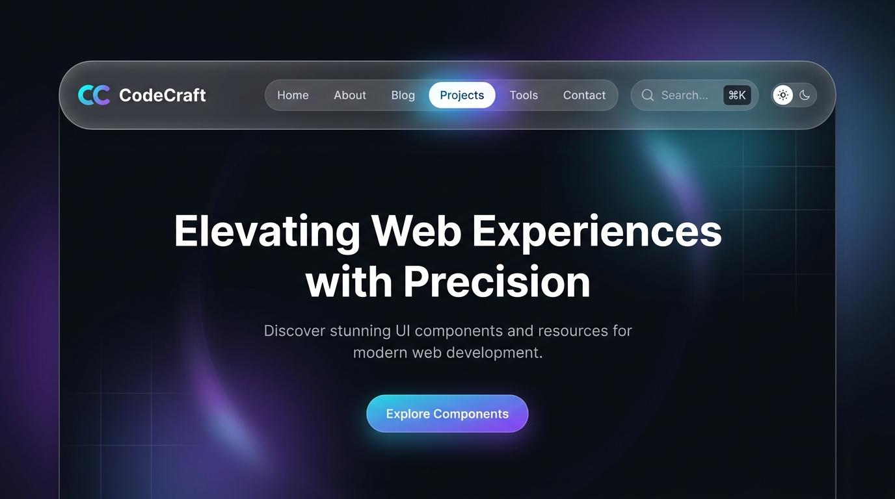

# 🧭 Floating Glass Navbar (Header Template)

Next.js 15+ ve Tailwind CSS ile hazırlanmış, sayfa kaydırıldıkça (scroll) daralan, cam (glassmorphism) efektli ve mobil uyumlu yüzen pill navigasyon çubuğu şablonu.

Bu tasarım, [yunusemrecagan.com](https://yunusemrecagan.com) ana sitesinde kullanılan imza header tasarımının modüler ve tak-çalıştır versiyonudur.

<br />

<div align="center">
  
</div>

---

## ⚡ Kullanım Yöntemleri

### Yöntem 1: Doğrudan Kendi Projenize Kopyalayın

Eğer mevcut bir Next.js projeniz varsa, sadece şu 2 bileşeni projenize eklemeniz yeterlidir:
1. `src/components/Navbar.tsx`
2. `src/components/ThemeToggle.tsx`

Gereken küçük yardımcı paketler:
```bash
npm install lucide-react next-themes clsx tailwind-merge
```

Ardından istediğiniz sayfada çağırın:
```tsx
import { Navbar } from "@/components/Navbar";

export default function Layout() {
  return (
    <>
      <Navbar
        brand={{ name: "Markam", href: "/" }}
        navItems={[
          { label: "Ana Sayfa", href: "/" },
          { label: "Hakkımda", href: "/hakkimda" },
          { label: "Blog", href: "/blog" },
          { label: "İletişim", href: "/iletisim" },
        ]}
      />
      <main>{/* sayfa içeriği */}</main>
    </>
  );
}
```

---

### Yöntem 2: Bağımsız Başlangıç Projesi Olarak Çekin (`degit`)

```bash
npx degit yunusemre-cagan/boilpoint/templates/headers/floating-glass yeni-header-projem
cd yeni-header-projem
npm install
npm run dev
```

---

## ⚙️ Bileşen Özellikleri (Props)

| Prop Adı | Tip | Varsayılan | Açıklama |
| :--- | :--- | :--- | :--- |
| `brand` | `{ name: string; href?: string; logoNode?: ReactNode }` | `{ name: "Boilpoint" }` | Marka adı veya özel logo bileşeni |
| `navItems` | `Array<{ label: string; href: string }>` | Standart menü | Menü linkleri dizisi |
| `showSearch` | `boolean` | `true` | `⌘K` arama butonunu göster/gizle |
| `showThemeToggle` | `boolean` | `true` | Koyu/Açık tema butonunu göster/gizle |
| `onSearchClick` | `() => void` | CMD+K CustomEvent | Arama butonuna tıklandığında tetiklenecek fonksiyon |

---

## 📄 Lisans
MIT - İstediğiniz kişisel ya da ticari projede özgürce kullanabilirsiniz.
